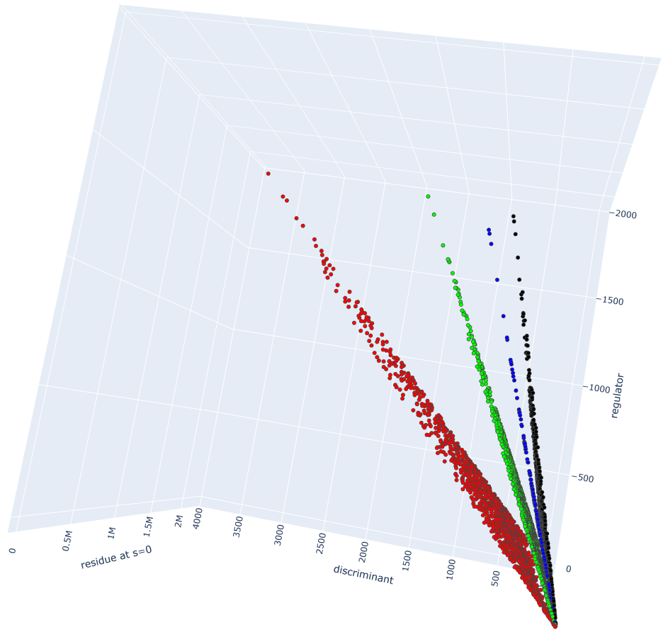

# The Idea

The idea is to use algorithmic, computational and Machine Learning techniques for classifying real quadratic fields by their class number. Currently, we have attempted binary classification by class number 1 versus 2 (which worked well) and by class number 1 versus 3 (which turned out to be an extremely hard task).

# The data

- [Real Quadratic Field (Class Number 1 vs. 2) on Kaggle](https://www.kaggle.com/datasets/eldarsultanow/real-quad-fields-1-2/settings) 
- [Real Quadratic Field (Class Number 1 vs. 3) on Kaggle](https://www.kaggle.com/datasets/eldarsultanow/real-quadratic-field-class-number-1-vs-3)

# Class number distributed along residue_0, discriminant and regulator
The following plot shows four classes of real quadratic fields distributed along residue_0, discriminant and regulator: class number 1 (red), class number 2 (green), class number 3 (blue), class number 4 (black).

  |    |  
:------------------:|:--------------------:|:--------------------: 

The following plot shows five classes of real quadratic fields distributed along residue_0 and regulator: class number 1 (red), class number 2 (green), class number 3 (blue), class number 4 (black), class number 5 (yellow).

